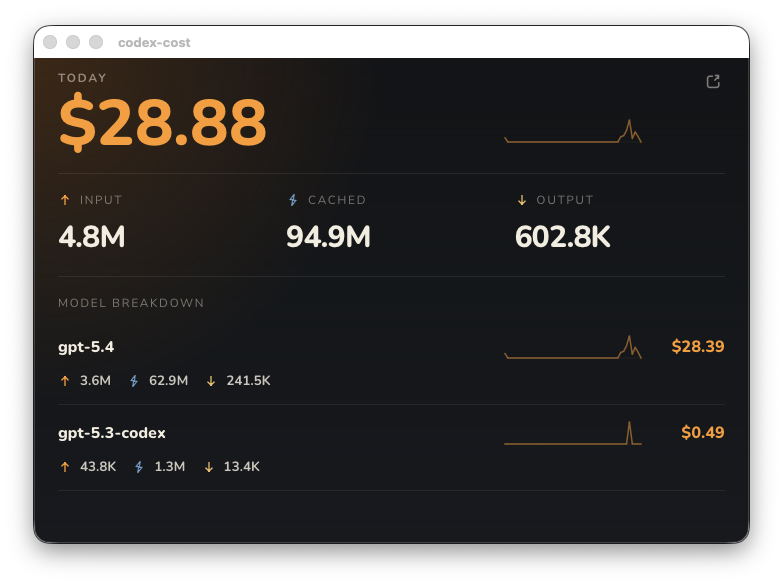

<p align="center">
  
</p>

<h1 align="center">codex-cost</h1>

<p align="center">A lightweight desktop tray app for Codex users who want today's cost visible at a glance.</p>

<p align="center">
  <a href="https://github.com/xbotter/codex-cost/releases">
    
  </a>
  <a href="LICENSE">
    
  </a>
  
  
  
  
  
  
</p>

`codex-cost` is a lightweight desktop tray app for Codex users who want to keep today's cost visible at a glance.

It reads local Codex usage logs, estimates the current day's USD cost, and keeps that number close at hand through a tray icon, tooltip, and compact dashboard.



## Highlights

- Always-on tray app for Windows, macOS, and Linux
- Reads local Codex logs directly
- Tracks daily usage in local timezone
- Includes subagent usage
- Uses online LiteLLM pricing with local cache fallback
- Provides a quiet dashboard for cost and token breakdown

## What It Feels Like

`codex-cost` is designed to stay out of the way.

- Live in the tray instead of a terminal tab
- Check today's value in one glance
- Open a compact dashboard only when you need detail
- Close the window without quitting the app

## Installation

Download the latest release for your platform from GitHub Releases.

Windows builds are distributed as an NSIS installer. The installer also places `WebView2Loader.dll` next to the app binary to avoid missing-loader startup failures.

## How It Works

`codex-cost` reads local Codex session JSONL logs and calculates usage from session deltas instead of summing raw cumulative counters.

The current implementation:

- groups usage by local day
- treats billable input as `input_tokens - cached_input_tokens`
- includes `reasoning_output_tokens` in output cost
- preserves cross-day session baselines to avoid overcounting

## Acknowledgements

This project is inspired by [`ccusage`](https://github.com/ryoppippi/ccusage).

Its Codex pricing and accounting behavior were an important reference while validating the usage model in `codex-cost`. This project takes that accounting direction and turns it into a desktop tray experience focused on always-on visibility.

## Development

Requirements:

- Node.js 20+
- Rust stable
- Tauri v2 prerequisites for your platform

Install dependencies:

```bash
npm install
```

Run local checks:

```bash
npm run check
```

Run in development:

```bash
npm run tauri dev
```

Build release artifacts locally:

```bash
npm run build
npx tauri build
```

## License

MIT. See [LICENSE](LICENSE).
